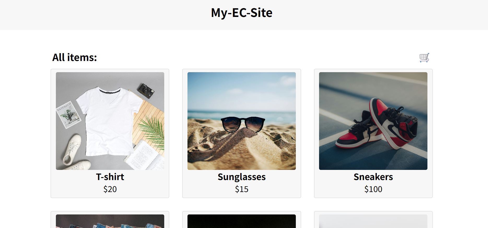

# Mini EC Site

## プロジェクト概要

シンプルなフロントエンドECサイトです。  
Next.js（App Router）を使用し、以下の機能を実装しています：

- 商品一覧表示
- 商品詳細ページ
- カートに追加
- カートページで削除・合計金額計算
- 購入完了画面（ダミー）

ローカルストレージを使用してカート機能を実現しており、Firebaseなどのバックエンドは使用していません。
  
## 使用技術・ツール

- Next.js (App Router)
- React
- JavaScript
- CSS Modules
- ローカルストレージ

## 主な機能

- 商品一覧ページ（商品名・画像・価格）
- 商品詳細ページ
- カートに追加（ローカルストレージ使用）
- カートページ（削除・合計金額計算）
- 購入完了ページ（アラート表示）

## 学んだこと・工夫した点

- Next.jsのApp Router構造(layout.js / page.js)の理解
- 動的ルーティングとURLパラメーターを活用した商品詳細ページの実装
- 再利用性を高めるため、商品データを外部ファイル(`data/products.js`)に分離
- CSSを活用して、各ページでスタイルが衝突しないように管理

## 公開サイト

こちらからデプロイ後のサイトをご覧いただけます：
[https://my-mini-ec-site.vercel.app/](https://my-mini-ec-site.vercel.app/)

## デザイン

### トップページ

## 連絡先

以下から気軽にご連絡ください：
- E-mail: [whoisyuma.0913@gmail.com](whoisyuma.0913@gmail.com)

## 備考

このアプリは学習用として作成しました。

# Mini EC Site

## Project Overview

This is a simple frontend e-commerce site built using **Next.js (App Router)**.  
It implements the following features:

- Product listing  
- Product detail page  
- Add to cart  
- Cart page with delete and total calculation  
- Purchase completion screen (dummy)

The cart feature uses **localStorage**, and no backend services like Firebase are used.

## Technologies & Tools

- Next.js (App Router)  
- React  
- JavaScript  
- CSS Modules  
- localStorage

## Main Features

- Product listing page (name, image, price)  
- Product detail page  
- Add to cart (stored in localStorage)  
- Cart page (remove items, calculate total)  
- Purchase confirmation page (with alert message)

## Learning & Highlights

- Gained an understanding of Next.js App Router structure (`layout.js` / `page.js`)  
- Implemented dynamic routing with URL parameters for product detail pages  
- Separated product data into an external file (`data/products.js`) for reusability  
- Managed CSS to avoid style conflicts across different pages

## Live Site

You can view the deployed site here:  
[https://my-mini-ec-site.vercel.app/](https://my-mini-ec-site.vercel.app/)

## Design

### Top Page

## Contact

Feel free to reach out:  
- E-mail: [whoisyuma.0913@gmail.com](mailto:whoisyuma.0913@gmail.com)

## Notes

This app was created for learning purposes.
